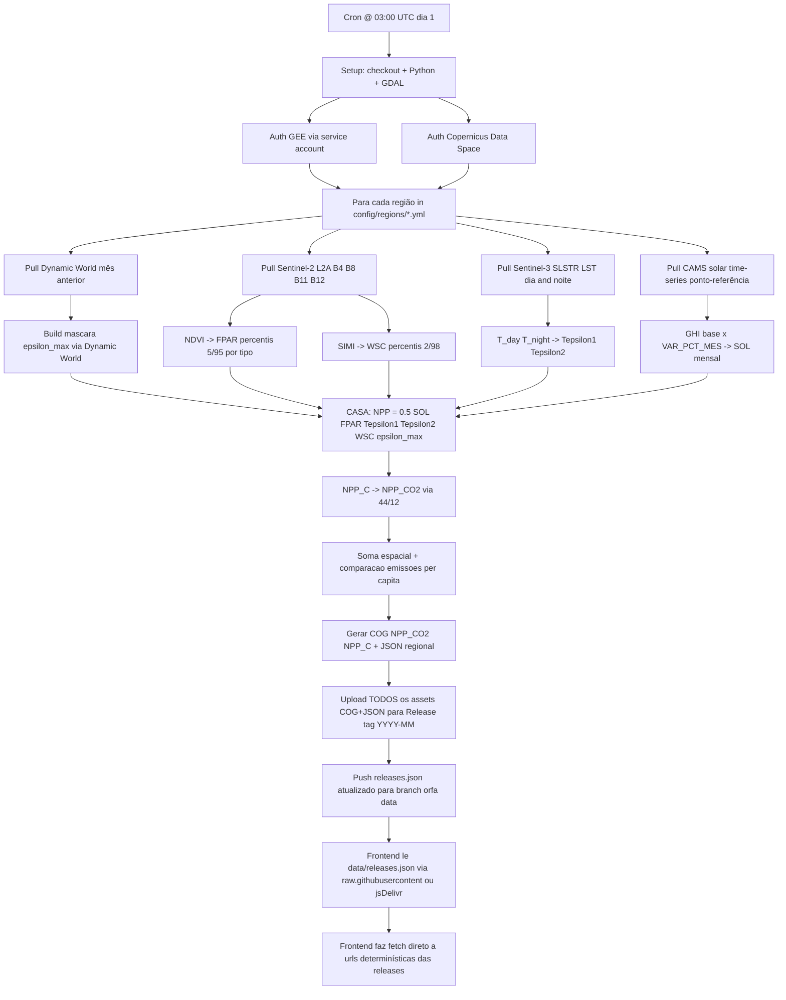

# Pipeline GHA Cron — Especificação Operacional

Detalhe técnico do pipeline mensal automatizado. Complementa [decisoes-arquitetura.md](decisoes-arquitetura.md) (ADR-003, ADR-004, ADR-005, ADR-006) — aqui está o *como*, lá está o *porquê*.

## 1. Visão geral

No dia 1 de cada mês, às 03:00 UTC, o GitHub Actions Cron dispara o workflow `.github/workflows/monthly_npp.yml`. O workflow corre, por cada região configurada (Oeiras, Lisboa, Flores, …), o pipeline CASA completo para o mês anterior, gerando 1 COG por raster intermédio (NDVI, FPAR, WSC, Tε2, SOL, ε_max, NPP_C, NPP_CO2) e 1 JSON consolidado por região. **Todos os outputs (COG + JSON) vão como assets de uma GitHub Release com tag `YYYY-MM`** — zero commits ao repo principal após Cron. A Vercel **não** é envolvida nesta etapa; o frontend faz `fetch` directo às urls das releases.

## 2. Diagrama de fluxo



## 3. Etapas detalhadas

### 3.1 Setup (≈ 30 s)

| Step | Tool | Notas |
|---|---|---|
| `actions/checkout@v4` | GHA | shallow clone, sem LFS |
| `actions/setup-python@v5` | GHA | Python 3.12, cache pip |
| Install GDAL + rasterio | apt + pip | usar imagem pré-baked com GDAL para evitar 5 min de build |
| Install project deps | `uv pip install -e .` | pyproject + lockfile |

**Fail mode**: se setup falha, workflow termina antes de gastar quota GEE/Sentinel Hub. Retry manual via "Re-run".

### 3.2 Autenticação (≈ 5 s)

| Secret | Origem | Uso |
|---|---|---|
| `GEE_SERVICE_ACCOUNT_JSON` | Google Cloud service account | Earth Engine Dynamic World |
| `CDSE_CLIENT_ID` / `CDSE_CLIENT_SECRET` | Copernicus Data Space client credentials | Sentinel-2 / Sentinel-3 |

**Stub durante ADR-006 pendente**: se `GEE_SERVICE_ACCOUNT_JSON` não está definido, usar máscara estática ESA WorldCover 2021 incluída no repo (`data/fallback/esa_worldcover_oeiras.tif`). Log "USING FALLBACK MASK" para visibilidade.

### 3.3 Loop por região

Iteração externa por região (`config/regions/*.yml`). Cada região é independente — em falha, não bloqueia as outras. Resultados parciais ainda são publicados.

Configuração mínima por região:
```yaml
# config/regions/oeiras.yml
name: Oeiras
geometry_wkt_path: data/geometry/oeiras.wkt
population: 172120
emissions_co2_per_capita_month: 0.8917  # t CO2 / hab / mês (Eurostat 2025)
cams_reference_point: {lat: 38.7239, lon: -9.2903}
cams_var_pct_strategy: hardcoded_table  # ou: live_query
var_pct_mes: {1: -40.72, 2: -17.60, ...}  # opcional, se hardcoded
```

### 3.4 Pull de dados externos

| Fonte | API | Output local | Tamanho típico (Oeiras 10×10 km) |
|---|---|---|---|
| Dynamic World | GEE Python SDK | `tmp/dw_mask.tif` (10 m, 1 banda categórica) | ~5–10 MB |
| Sentinel-2 L2A | CDSE OData/Sentinel Hub | `tmp/s2_b4.tif`, `s2_b8.tif`, `s2_b11.tif`, `s2_b12.tif` | ~20 MB cada |
| Sentinel-3 SLSTR LST | CDSE OData | `tmp/s3_lst_day.tif`, `s3_lst_night.tif` (1 km) | ~1 MB cada |
| CAMS solar | Atmosphere Data Store API | `tmp/cams.csv` ou directo em memória | < 100 KB |

**Critérios de selecção S2/S3**: cobertura de nuvens < 30%, data mais próxima do meio do mês. Se nenhuma imagem qualifica, registar warning e usar último mês disponível (com flag `data_quality: degraded` no JSON output).

**Fail mode**: falha de download não bloqueante por região individual — passa à próxima. Sempre que possível, fallback para Sentinel-2 sem L2A (L1C) ou para mês anterior. Logado.

### 3.5 Pipeline CASA (vectorizado, NumPy)

**Schema canónico de landcover** — antes do cálculo de ε_max, qualquer fonte (Dynamic World ou ESA WorldCover stub) é convertida para o schema canónico interno (ver [ADR-011](decisoes-arquitetura.md#adr-011--schema-canónico-de-cobertura-do-solo)). Códigos UInt8: 0=`non_vegetation`, 1=`trees`, 2=`shrub_and_scrub`, 3=`grass`, 4=`crops`, 5=`flooded_vegetation`. Ficheiros `config/epsilon_max/*.yml` mapeiam canonical→ε_max, nunca DW/ESA directos. **Adaptadores são defensivos** — qualquer classe não mapeada ou pixel NoData/NaN cai em `non_vegetation=0` por construção (`numpy.zeros` base + `numpy.where` por classe conhecida); warning logado se mais de 5% dos pixels caírem no default (sinal de versão nova do dataset).

**Processamento windowed end-to-end** — todas as etapas operam por janela (ver [ADR-012](decisoes-arquitetura.md#adr-012--pipeline-windowed-end-to-end)). Cada função aceita `window: rasterio.windows.Window | None`. O orquestrador itera janelas de 1024×1024 ou 2048×2048 pixels da grade comum. Pico de memória por janela: ~48 MB. Sem isto, o WarpedVRT lazy do Sentinel-3 LST (secção anterior) é inútil.

| Step | Input | Output | Notas |
|---|---|---|---|
| `ndvi.compute` | `s2_b4.tif`, `s2_b8.tif` | `ndvi.tif` | `(B8-B4)/(B8+B4)`, vectorizado, por janela |
| `landcover.to_canonical` | `dw_mask.tif` (ou `esa_fallback.tif`) | `landcover.tif` (canonical UInt8) | `dw_to_canonical()` ou `esa_to_canonical()` |
| `fpar.compute` | `ndvi.tif`, `landcover.tif`, `config/fpar_percentiles.yml` | `fpar.tif` | percentis 5/95 por classe canónica |
| `wsc.compute` | `s2_b11.tif`, `s2_b12.tif`, `config/wsc_percentiles.yml` | `wsc.tif` | SIMI → NSIMI → WSC |
| `tstress.compute` | `s3_lst_day.tif`, `s3_lst_night.tif`, `landcover.tif`, `config/t_opt_by_biome.yml` | `t1.json` + `t2.tif` | `T_opt` climatológico por classe canónica; WarpedVRT lazy |
| `sol.compute` | `data/sol/ghi_base.tif`, `cams.csv` | `sol.tif` | MJ/m²/mês |
| `emax.build` | `landcover.tif`, `config/epsilon_max/xu2023.yml` | `emax.tif` | lookup table canonical → ε_max |
| `npp.compute` | todos os anteriores | `npp_c.tif` | `0.5 * SOL * FPAR * Tε1 * Tε2 * WSC * εmax`, **windowed** (lê inputs com `window=`, escreve output com `window=`) |
| `npp.to_co2` | `npp_c.tif` | `npp_co2.tif` | `* 44/12` |

**Grade comum**: tudo reprojectado para a grade do FPAR (Sentinel-2 10 m, EPSG:32629 UTM 29N para Oeiras). Reproject via `rasterio.warp.reproject` com `Resampling.bilinear` para contínuos, `Resampling.nearest` para categóricos.

**Reamostragem Sentinel-3 LST (1 km → 10 m)** — caso especial, pois o factor de upsampling é 100× por dimensão. Naïve: alocar array destino completo em float32 → 1000×1000 pixels = ~4 MB para Oeiras, ~57 MB para Flores (143 km²). Para evitar picos de RAM em runner standard GHA (7 GB) e suavizar o efeito "escada":

- Usar `rasterio.vrt.WarpedVRT(src, crs=target_crs, transform=target_transform, width=target_width, height=target_height, resampling=Resampling.bilinear)` para vista *lazy*.
- Ler por janela (`vrt.read(window=Window(...))`) e processar em blocos de 512×512 pixels.
- **Algoritmo de interpolação**: `Resampling.bilinear` para LST contínuo. `Resampling.cubic` evitado — pode introduzir overshoots fisicamente impossíveis (LST < 0 K) em transições abruptas.
- A suavidade visual é melhorada vs. nearest-neighbour, mas **a resolução efectiva do termo Tε permanece 1 km**. Ver "Limitações físicas" (secção 8).

**Máscara espacial**: WKT da região aplicada como passo final via `rasterio.mask.mask`, não pelo hack do "último pixel".

### 3.6 Agregação + relatório

| Métrica | Fórmula | Notas |
|---|---|---|
| `total_t_C` | `sum(NPP_C válidos) · area_pixel_m² / 1e6` | área pixel = 100 m² (Sentinel-2 10 m). **Bug `NPP_RESULT.py:54` corrigido aqui** |
| `total_t_CO2` | `total_t_C · 44/12` | conversão estequiométrica |
| `emissoes_t_CO2` | `population · emissions_co2_per_capita_month` | da config da região |
| `absorbed_pct` | `total_t_CO2 / emissoes_t_CO2 · 100` | métrica headline |

JSON output (`{region}.json`):
```json
{
  "region": "oeiras",
  "month": "2026-04",
  "data_quality": "ok",
  "satellite_scenes": ["S2C_MSIL2A_20260415T112141"],
  "totals": {
    "npp_c_t_month": 4521.3,
    "npp_co2_t_month": 16594.8,
    "emissions_co2_t_month": 153479.4,
    "absorbed_pct": 10.81
  },
  "generated_at": "2026-05-01T03:14:22Z"
}
```

### 3.7 Upload outputs

**Todos os outputs vão para a mesma GitHub Release** (tag `YYYY-MM`). Nada é commitado no repo principal. Ver [ADR-005](decisoes-arquitetura.md#adr-005--storage-dos-outputs-cog-e-json) para justificação.

| Asset | Destino |
|---|---|
| `{region}_npp_co2.tif` (COG) | Release `YYYY-MM` asset |
| `{region}_npp_c.tif` (COG) | Release `YYYY-MM` asset |
| `{region}.json` | Release `YYYY-MM` asset |
| `index.json` (manifesto de regiões e status do mês) | Release `YYYY-MM` asset |

Ferramenta: `gh release create YYYY-MM <files...>` (criação) ou `gh release upload YYYY-MM <files...> --clobber` (update).

**Convenção COG**: `gdal_translate -of COG -co COMPRESS=DEFLATE -co PREDICTOR=2 -co BLOCKSIZE=512`. Pode ser lido browser-side por `georaster`/`georaster-layer-for-leaflet`.

### 3.8 Atualização do manifesto na branch `data`

Após upload da Release, o workflow atualiza `releases.json` numa **branch órfã `data`** — separada de `main`, não dispara rebuild Vercel.

```bash
# Pseudo-código do step
git fetch origin data
git checkout data
python tools/update_releases_manifest.py --tag $TAG  # gera/atualiza releases.json
git add releases.json
git commit -m "data: $TAG"
git push origin data
```

Formato `releases.json`:
```json
{
  "updated_at": "2026-05-01T03:14:22Z",
  "latest_tag": "2026-04",
  "releases": [
    {"tag": "2026-04", "regions": ["oeiras", "lisboa", "flores"], "data_quality": {"oeiras": "ok", "lisboa": "ok", "flores": "degraded"}},
    {"tag": "2026-03", "regions": ["oeiras", "lisboa", "flores"], "data_quality": {"oeiras": "ok", "lisboa": "ok", "flores": "ok"}}
  ]
}
```

### 3.9 Discovery no frontend (sem rate limit)

**Não chamar a API GitHub** (limite 60 req/h por IP unauthenticated). Usar URLs determinísticas + manifesto via raw/CDN:

1. **Boot**: 1 fetch a `https://raw.githubusercontent.com/{user}/{repo}/data/releases.json` (cache CDN Cloudflare ~5 min — aceitável para dados mensais). **jsDelivr não é default** (cache agressivo até 24 h); se usado, anexar cache-busting `?t=${Math.trunc(Date.now()/300000)}`.
2. **Time slider**: construído com os `tag`s do manifesto.
3. **Carregar mês X, região Y**:
   - COG: `https://github.com/{user}/{repo}/releases/download/{tag}/{region}_npp_co2.tif`
   - JSON: `https://github.com/{user}/{repo}/releases/download/{tag}/{region}.json`
   - Atalho para o último: `https://github.com/{user}/{repo}/releases/latest/download/oeiras.json` (sem precisar saber a tag).

CORS aberto em ambos (raw e releases assets).

## 4. Cron schedule

```yaml
# .github/workflows/monthly_npp.yml (excerpt)
on:
  schedule:
    - cron: "0 3 1 * *"   # 03:00 UTC, dia 1 de cada mês
  workflow_dispatch:       # também invocável manualmente
```

**Por que dia 1 às 03:00 UTC**:
- Sentinel-2 typically tem revisita 5 dias; no dia 1 do mês há geralmente cobertura completa do mês anterior já processada.
- 03:00 UTC = 04:00 Lisboa (CET) / 03:00 Lisboa (UTC verão), fora do horário de uso humano.

**Backfill**: `workflow_dispatch` aceita parâmetro `month` (formato `YYYY-MM`) para reprocessar manualmente. Útil quando uma região falha ou após alteração da tabela ε_max.

## 5. Tempo estimado por execução

| Fase | Tempo (Oeiras 10×10 km) |
|---|---|
| Setup | 30 s |
| Auth | 5 s |
| Pull Dynamic World | 1 min |
| Pull S2 (4 bandas) | 2–4 min |
| Pull S3 (LST dia + noite) | 1 min |
| Pull CAMS | 5 s |
| Pipeline CASA | 30–60 s (vectorizado) |
| Upload COGs + commit | 30 s |
| **Total por região** | **~5–8 min** |
| **Total 3 regiões (paralelo possível)** | **~6–12 min** |

GitHub Actions free tier: 2000 min/mês private, ilimitado public. Largura confortável.

## 6. Fail-safe / retry

- **Falha de uma região**: log, continua com as outras. JSON da região falhada não é actualizado; frontend serve o último válido.
- **Falha de download**: 3 retries com backoff exponencial (10 s, 30 s, 90 s). Se falham todas, fallback para último mês disponível.
- **Falha de upload Release**: 3 retries. Se falha, mantém JSON antigo no repo, log erro, abre issue automaticamente (`gh issue create`).
- **Falha completa do workflow**: notificação por email (GHA default). Workflow `workflow_dispatch` pode ser re-disparado manualmente.

## 7. Diferença vs pipeline original do relatório

| Aspecto | Relatório (manual) | Pipeline novo (GHA Cron) |
|---|---|---|
| Trigger | Manual, ad-hoc | Cron mensal automático |
| Máscara vegetação | ESA WorldCover 2021 estático | Dynamic World near-real-time |
| FPAR normalização | min/max por imagem | percentis 5/95 por tipo (Xu 2023) |
| WSC normalização | min/max por imagem | percentis 2/98 históricos |
| `T_opt` | `mean(LST cena)` (errado) | climatológico por bioma |
| `ε_max` | Tabela origem incerta | Xu 2023 (default) ou relatório (override) |
| Reamostragem S3 LST | redimensionar out-of-band com PIL (corrompe CRS) | `WarpedVRT` lazy + bilinear, leitura por janela |
| Orquestrador | `main.py` (ausente em V3.1) | `cli.py` + `pipeline.py` |
| Output | TIFFs locais + relatório txt | COG + JSON em GitHub Releases |
| Frontend | nenhum | Leaflet/MapLibre + georaster, fetch directo às Releases |
| SNAP/snappy | runtime crítico | offline-only, removido do pipeline novo |

## 8. Limitações físicas e resolução efectiva

A resolução nominal do produto final (10 m, grade Sentinel-2) **não é a resolução efectiva** de cada termo:

| Termo | Resolução nativa | Resolução após pipeline |
|---|---|---|
| FPAR (B4, B8) | 10 m | 10 m |
| WSC (B11, B12) | 20 m | 10 m (downsampled-up, ganho marginal) |
| ε_max (Dynamic World) | 10 m | 10 m |
| SOL (Global Solar Atlas) | ~250 m | 10 m (upsampled bilinear; suavizado) |
| **Tε1, Tε2 (Sentinel-3 LST)** | **1 km** | **10 m (upsampled bilinear; resolução efectiva permanece 1 km)** |

**Implicação**: o produto NPP final é dominado, em escala fina, por FPAR/ε_max (10 m); mas o sinal térmico (Tε) só varia em blocos de 1 km. Isto é uma limitação **física do sensor S3 SLSTR**, não do pipeline.

**Comunicação no frontend**: legenda do mapa deve indicar "resolução efectiva: ~1 km para stress térmico; ~10 m para vegetação e ε_max".

**Mitigação futura possível**: substituir Sentinel-3 LST por Landsat 8/9 TIRS (100 m) ou ECOSTRESS (70 m, ISS) para análises focadas em micro-clima urbano. Fica como trabalho futuro — actualmente Sentinel-3 é a fonte oficial usada pelo relatório.
